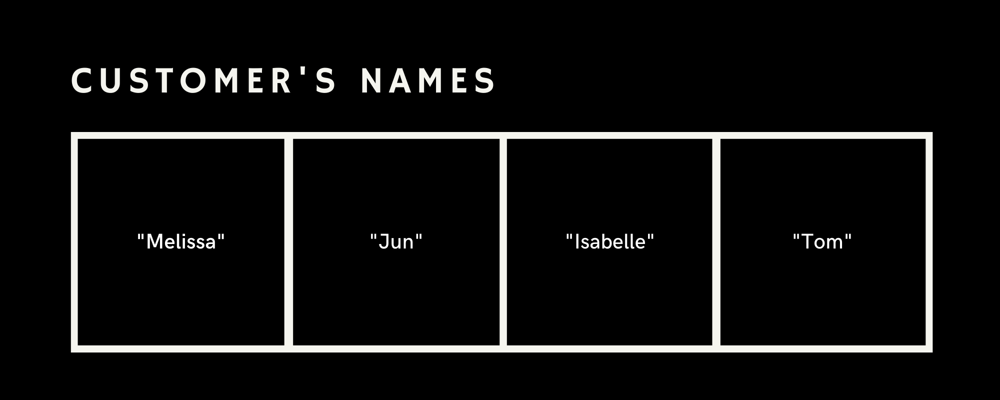

---
title: "The Delivery"
date: 2020-02-10T13:24:17-07:00
draft: false
weight: 1
--- 

<link rel="stylesheet" href="../../style.css">

A hashmap is very similar to a dictionary. In a dictionary, you might want to look up a definition for a certain word. You simply look up the keyword in the dictionary and by doing so, you can get the definition attached to that keyword.

Hashmaps are very similar to dictionaries. A hashmap is a data structure that holds a collection of key-value pairs. It "maps" numerous keys to their respective values. If you have the key, you can easily use it to find the value behind it.

Let's think about how we could use a hashmap to help our driver find the address they need to deliver the order. Let's say that they have four customer orders they have to deliver. The way you store a key-value pair is arbitrary. but in this case, let's say that the four orders keys are the customer's name and the value that is returned is their address.

We want our driver to be able to access the addresses just like how you would look up definitions in a dictionary. By looking up "Melissa", you would return Melissa's address instead. We'll learn how to implement this behavior in the next page.