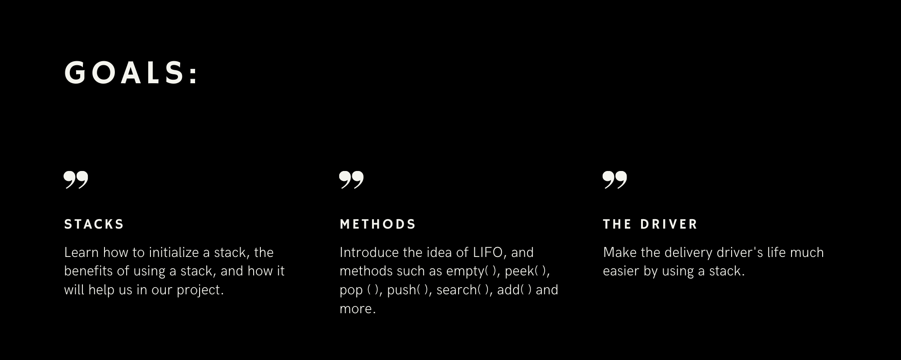

<iframe width="60%" height="600px" src="https://www.youtube.com/embed/bvZikXeALVY" frameborder="0" allow="accelerometer; autoplay; clipboard-write; encrypted-media; gyroscope; picture-in-picture" allowfullscreen></iframe>

<link rel="stylesheet" href="../style.css">

A driver has to both pick up an order and deliver it to the customer. A driver may pick up multiple orders at the same time. For maximum efficiency, a driver wants to pick up the most amount of orders and make the most deliveries in the shortest path possible. If a driver is on the way to pick up an order from a restaurant but suddenly a customer orders from a restaurant that is very close and on the way, to make the most out of their drive, a driver should be able to pick up the order from that restaurant. In general, a driver wants to pick up and deliver orders based on the shortest distance away. We can implement this behavior by utilizing a stack.

Topics

{}

