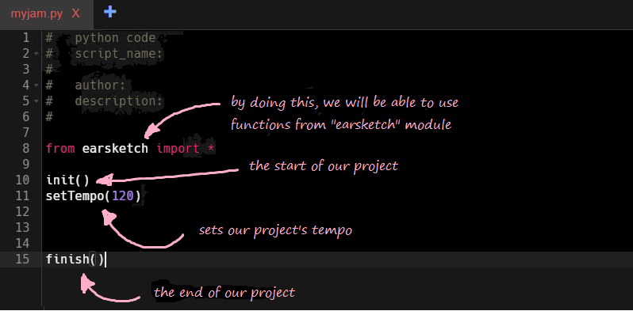
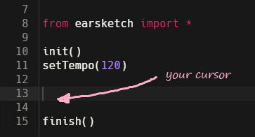
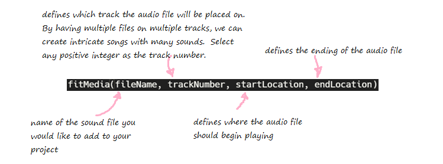

Let's take a closer look at the pre-existing code and understand what it means.  We will be placing our new code between the `setTempo()` and `finish()` functions. The `setTempo()` function allows you to set the overall project tempo.

{}
**Quick Fact**: Tempo is the speed at which a piece of music is played. Changing a project's tempo allows for different styles of music to be created. Try changing the tempo of your `setTempo` function and see what happens! Please make sure it is a number
between 45-220. 

{}

1. Now that our tempo is set, it is time to add sounds. To do so, we must utilize the `fitMedia()` function.
2. Make sure the cursor in your program is between `setTempo()` and `finish()` functions.
    
3. Navigate to the **Api Browser** icon on the left side menu. Scroll through the list to the `fitMedia()` function.
4. Click on **Paste** icon on the right corner of `fitMedia()` to insert the function between the `setTemp` and `finish` functions.
5. You may notice that when you paste the function, Earsketch produces some placeholder texts that we will need to replace later. These placeholder texts are also known as `parameters`.

    
    You can specify your own values for the following:
    -   `fileName` - Navigate to the \'Sounds\' pane and find a sound
        you like.
    -   `trackNumber` - Select any positive integer as the track number.
    -   `startLocation/endLocation` - These parameters are quantified in
        measures. A measure is a segment of time which correlates to a
        specific number of beats.

    If you are not sure what values to choose, try this:
    `fitMedia(YG_TRAP_ELECTRIC_PIANO_FILTERED_1, 3, 1, 17)`
    Your code should now look something like this:
        
    {}
    from earsketch import *

        init()
        setTempo(120)

        fitMedia(YG_TRAP_ELECTRIC_PIANO_FILTERED_1, 3, 1, 17)

        finish()
    {}

    {} Make sure the capitalization of the method call is correct. Most programming languages, Python included, are case sensitive. This means that adding capital letters can call a different function than expected. For example: `fitMedia()` is not the same as `FitMedia()`.
    {}

6. Once you have input your own parameters, press run, then click on
    play to listen to your audio clip! 
    
    **If you see any red text, you have encountered some errors! Please ask for help.**
    The `fitMedia()` function is the backbone to making music in Earsketch. We will be using this function a lot, so if you have any questions regarding its usage, please ask!