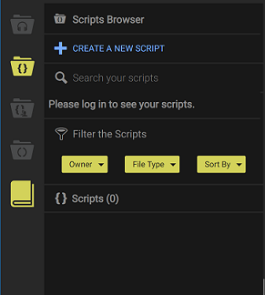
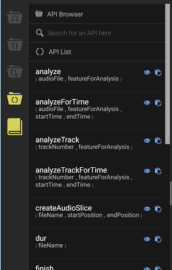
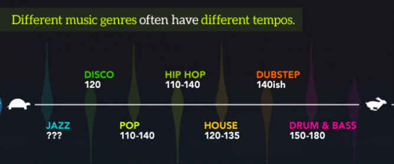
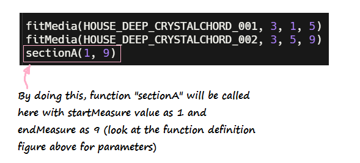
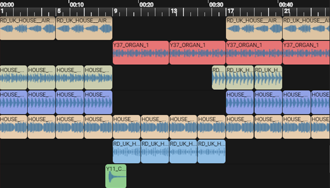
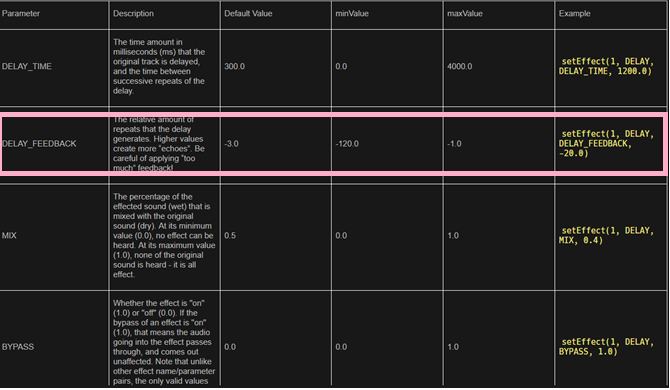

# Let's make some music

An introductory guide on how to make music using
[EarSketch](https://en.wikipedia.org/wiki/EarSketch) & Python.


::: {.container-fluid}
::: {.row}
::: {.col-xs-6 .col-sm-4 .col-md-4 .col-lg-3}
::: {.list-group}
[**Introduction: Meet DJ Nuevo**](#intro){.list-group-item
.list-group-item-action} [**Music
basics**](#music-basics){.list-group-item .list-group-item-action}
[**Python basics**](#python-basics){.list-group-item
.list-group-item-action} [**Getting Started with
Earsketch**](#getting-started-earsketch){.list-group-item
.list-group-item-action} [**Activity 1** - Set tempo and Add
sounds](#activity-1){.list-group-item .list-group-item-action}
[**Activity 2** - Make a song](#activity-2){.list-group-item
.list-group-item-action} [**Functions**](#functions){.list-group-item
.list-group-item-action} [**Activity 3** - Organize your songs using
functions](#activity-3){.list-group-item .list-group-item-action}
[**Effects in Earsketch**](#effects){.list-group-item
.list-group-item-action} [**Activity 4** - Add effects to your
song](#activity-4){.list-group-item .list-group-item-action} [**Activity
5** - Fade in](#activity-5){.list-group-item .list-group-item-action}
[**Help, I am stuck!**](#help){.list-group-item .list-group-item-action}
:::
:::

# Nuevo has new headphones! Can you find yours? 
You got contacted to make Nuvi's next hit mixtape, but when you get to the studio, Nuvi says their next project is going to be produced all in code. This is something that hasn't been done before, are you up to the challenge? Look around yourself to find your headphones and get ready to
join him!

Before we start, we should check if your headphones are working. Try playing the following audio. What do you hear?

If you are reading this, it is because your browser does not support the audio element.

# Basics first. A few things about music.


## What is Music?
[Music](https://en.wikiversity.org/wiki/Introduction_to_music) is the chronological organisation of sounds; that is, making certain sounds at certain times, which make melodic, rhythmic and harmonic sense. The first, most basic concept, is keeping the sounds "in time". This leads us to some of the first few musical concepts: beat, rhythm, duration & tempo.

-   **Beat** is the regular pulse which provides a `timeline` for the
    rhythm to anchor itself to.
-   **Rhythm** is essentially repeated patterns of long or short, stressed or unstressed sounds or silences which fit into the main beat.
-   **Duration** is the length of notes or sounds or silences which facilitate the rhythm.
-   **Tempo** is the speed at which a piece of music is played.

# Python basics
To code music, we need to learn a little Python. Don't worry, it won't bite you. Python is one of the languages that we humans use to tell computers what to do. These languages are known as "programming languages". We will learn Python concepts throughout the class, but let's start with a simple print statement.

If you want to jump to a specific Python section, click on the topic
below:

-   [Print & Comments](#print-comments)
-   [Functions](#functions)

## Print & Comments
**Comments** are the parts of the code that do not get evaluated. In Python, they are preceded by the \# symbol. Anything after the \# symbol is part of the comment and is ignored by your code. Comments are put in the code to tell the readers what the code is doing. They can make maintenace of code easy and can also help in finding bugs.

**Print** statements are used to print something on the console. Use `print("Hello World")` to print *Hello World* in the output screen. We will later learn that print is a function and we use it to perform a print job. Whatever you pass to the `print` function is printed on the
screen.

Try it yourself! Write comment(s) below and add a print statement that prints *Hello World*! Don't forget to surround Hello World with quotation marks!

:::{datacamp-exercise="" lang="python"}
`                                     # This will get executed each time the exercise gets initialized                                 `{type="pre-exercise-code"}
`                                 `{type="sample-code"}
`                                     # This is a comment. Everything here will be ignored.                                     # Coders use this part to explain/maintain the code.                                     print("Hello World")                                 `{type="solution"}
`                                               test_function("print")                                 success_msg("Great work! Continue to the next section.")`{type="sct"}

::: {type="hint"}
Put the symbol (`#`) and write anything after it to create a comment.
Then use print function to print Hello World: Use
`print("Hello World")`.					

Put the symbol (`#`) and write anything after it to create a comment.
Then use print function to print Hello World: Use
`print("Hello World")`.


# Getting started with EarSketch
EarSketch is a free educational programming environment developed at Georgia Institute of Technology. We will be composing music using EarSketch today.

1.  To make music, click on
    [EarSketch](https://earsketch.gatech.edu/earsketch2/) to open it in a new tab. The **navigation bar** on the left side of the screen is your homebase for navigating through all that EarSketch has to offer.
    -   The first item of the navigation bar is the **Sounds** collection. It is the central location for all the pre-loaded sounds that earsketch has to offer. In the sound browser, you can filter which sounds appear based on the artists, the genre, or instruments.
    

    -   The next icon on the navigation bar is the **Scripts** pane. This is where we will write our code.
    

    -   The next (third from top) icon is the **Share** section. You can use this to save your code, download or share it with your friends. We will skip this section for this exercise.
    -   The last two icons on the navigation bar are the **API Browser** and the **Curriculum** guides.
        
        
        We will use **API browser** to make music. An
        *Application Programming Interface* or *API* is a set of code that is ready for you to use right away! You may notice two icons to the right of each API. The first icon  provides a description of the
        API and an example on how to use the API. The second icon
         copies and pastes the API
        into the code editor, so you do not even need to type it! We
        will use a couple of these in the coming sections.
    -   The last icon in the above picture shows the **Curriculum** guide. If you want to know more about EarSketch, you can explore the section that appears on the right side of the window when you click on it. We will skip this section for this exercise.

2.  Now, let\'s get started. Click on **Scripts**
     icon on the left menu bar and
    select *Create a new script*. When prompted to enter the script
    name, enter *myjam* and click on *Create* button.
    
3.  Do not delete any of the pre-existing code! We will insert our code in between them.

Activity 1 - Set tempo & Add sounds
-----------------------------------

1.  Let\'s take a closer look at the pre-existing code and understand
    what it means. 
    We will be placing our new code between the `setTempo()` and `finish()` functions. The `setTempo()` function allows you to set the overall project tempo.
    
    **Quick fact:** Tempo is the speed at which a piece of music is played. Changing a project\'s tempo allows for different styles of music to be created. Try changing the tempo of your `setTempo` function and see what happens! Please make sure it is a number
    between 45-220. 
    :::

2.  Now that our tempo is set, it is time to add sounds. To do so, we must utilize the `fitMedia()` function.
3.  Make sure the cursor in your program is between `setTempo()` and `finish()` functions.
    
4.  Navigate to  icon on the left side menu. Scroll through the list to the `fitMedia()` function.
5.  Click on  icon on the right corner of `fitMedia()` to insert the function between the 'setTempo' and 'finish' functions.
6.  You may notice that when you paste the function, Earsketch produces some placeholder texts that we will need to replace later. These placeholder texts are also known as 'parameters'.

    
    You can specify your own values for the following:
    -   `fileName` - Navigate to the \'Sounds\' pane and find a sound
        you like.
    -   `trackNumber` - Select any positive integer as the track number.
    -   `startLocation/endLocation` - These parameters are quantified in
        measures. A measure is a segment of time which correlates to a
        specific number of beats.

    [Show full code](#code-activity1)
    
    If you are not sure what values to choose, try this:
    `fitMedia(YG_TRAP_ELECTRIC_PIANO_FILTERED_1, 3, 1, 17)`\
    \
    Your code should now look something like this:
        ```
        from earsketch import *
        init()                                              setTempo(120)
        fitMedia(YG_TRAP_ELECTRIC_PIANO_FILTERED_1, 3, 1, 17)
        finish()```

    **Be careful:** Make sure the capitalization of the method call is
    correct. Most programming languages, Python included, are case
    sensitive. This means that adding capital letters can call a
    different function than expected. For example: `fitMedia()` is not
    the same as `FitMedia()`.

7.  Once you have input your own parameters, press run, then click on
    play to listen to your audio clip! **If you see any red text, you
    have encountered some errors! Please ask for help.** The
    `fitMedia()` function is the backbone to making music in Earsketch.
    We will be using this function a lot, so if you have any questions
    regarding its usage, please ask!


Activity 2 - Make a song
------------------------

Now that you have learned how to add sounds to Earsketch, let\'s try and
make a song! You should already have one audio clip in Earsketch, but
songs are made up of various instruments, so we need to add more audio
clips.

1.  Add another `fitMedia()` call.
2.  Find an audio clip you would like to add to your current song and
    input it under the \"fileName\" parameter.
3.  The \"trackNumber\" parameter should be a unique number. This will
    allow us to place our sounds on different tracks. Having different
    sounds on different tracks allows us to maintain organization of our
    sounds and play different sounds at the same time. Example: If the
    first `fitMedia()` call is on track 1, the second `fitMedia()` call
    should be on track 2.
4.  Complete the rest of the parameters.
5.  Repeat these steps until you have four different audio sounds in
    your song.

[Show full code]

Your code should now look something like this:
`                                             from earsketch import *                                             init()                                             setTempo(120)                                              fitMedia(RD_TRAP_BELLLEAD_1, 1, 5, 9)                                             fitMedia(YG_TRAP_STRINGS_2, 2, 1, 17)                                             fitMedia(YG_TRAP_ELECTRIC_PIANO_FILTERED_1, 3, 1, 17)                                             fitMedia(YG_TRAP_BASS_9, 4, 1, 9)                                                                                          finish()                                             `
# Functions

**Functions** are a way to organize pieces of similar or repeating code.
Rather than having to constantly type out the same code, we can put the
desired code in a method and call it whenever we want to use it.

::: {.alert .alert-info role="alert"}
**Note:** The purpose of a function is to help reduce redundant code
throughout the program.
:::

## Creating a function - Function declaration & definition

**Declaration:** To make a function in python, we must use the `def`
keyword. This keyword tells the code editor where the function is
defined. `def` is followed by the name of the function. In order to
generalize the function (so that we can use it at multiple places), we
might need to send some information to it. This is achieved using
parameters. They are placed in between parentheses `()` and follows
right after the name of the function. If no parameters are needed, they
can be ignored. The function declaration ends with a colon. Here\'s what
a function looks like:


**Warning:** Make sure that the first line of your function always ends
with a colon `:`

**Definition:** In Python, indentation defines which code is controlled
by the function. For example, look at the following image:

The code that is indented underneath the `sectionA` function is the code
that is executed each time function `sectionA` is called.

**Warning:** Since identation is very important in Python, make sure
that the body of the function always starts with 2 spaces.

## Using the function - Function call

To call a function, input the name of the function and its parameters
wherever you want to execute the function. For example, in order to call
function `sectionA`, we would do something like this:


**Be careful:** When making a function in Python, you must define the
function and its contents before it is called. In other words, in the
code, you need to put the function declaration above the function call.
Otherwise, you will receive a NameError like below. See the following
figure for an example:


## Challenge - Create your own function!

**Challenge:** Create a function called addNumbers that takes 2
parameters called number1 & number2 and prints the sum on console. Call
the function addNumbers with parameters 3 & 5.\
What is printed on the console?
{datacamp-exercise="" lang="python"}
`                                     # This will get executed each time the exercise gets initialized                                 `{type="pre-exercise-code"}
`                                     # Create a function called addNumbers                                      # that takes 2 parameters called number1 & number2                                     # and prints the sum on console.                                     # Call the function addNumbers with parameters 3 & 5.                                     # What is printed on the console?                                 `{type="sample-code"}
`                                     # Create a function called addNumbers                                      # that takes 2 parameters called number1 & number2                                     # and prints the sum on console.                                     # Call the function addNumbers with parameters 3 & 5.                                     # What is printed on the console?                                      def addNumbers(number1, number2):                                         print(number1+number2)                                      addNumbers(3,5)                                 `{type="solution"}
`                                     test_function("addNumbers")                                     success_msg("Great job!")                                 `{type="sct"}
::: {type="hint"}
Use (`def`) to create a function. Code inside function should be
\"TAB\"d. Call the function with parameters `3` & `5`.

Activity 3 - Organize your songs using functions
------------------------------------------------

In Earsketch, functions are mostly used to organize different sections
of a song. The most common musical form is A-B-A where each section is
four measures in length, and the A sections sound different from the B
section.

Now that we learned how to use functions, let\'s try to use them to
organize our songs better.

1.  Define your function with a `startMeasure` parameter and
    `endMeasure` parameter.
2.  Place the sounds you would like to have the function represent
    underneath your function definition.
3.  Try to make multiple sections of a song (verse, chorus, intro, etc.)
    and define them with your functions. If you don\'t do this, and only
    use multiple `fitMedia` calls, you will notice that your program
    will become long and hard to understand. To help avoid having a
    large project file, use functions!

[Show full code]

Your code should now look something like this:
`                                             from earsketch import *                                             init()                                             setTempo(120)                                                                                          fitMedia(HOUSE_DEEP_CRYSTALCHORD_001, 3, 1, 5)                                             fitMedia(HOUSE_DEEP_CRYSTALCHORD_002, 3, 5, 9)                                                                                          # Section A                                             def sectionA(startMeasure, endMeasure):                                                 fitMedia(RD_UK_HOUSE__AIRYPAD_1, 1, startMeasure, endMeasure)                                                 fitMedia(HOUSE_MAIN_BEAT_002, 4, startMeasure, endMeasure)                                                 fitMedia(HOUSE_ROADS_BASS_001, 5, startMeasure, endMeasure)                                                 # Section B                                             def sectionB(startMeasure, endMeasure):                                                 fitMedia(Y37_ORGAN_1, 2, startMeasure, endMeasure)                                                 fitMedia(HOUSE_ROADS_BASS_001, 5, startMeasure, endMeasure)                                                 fitMedia(RD_UK_HOUSE__ARPLEAD_1, 6, startMeasure, endMeasure)                                              sectionA(1, 9)                                             sectionB(9, 17)                                             sectionA(17, 25)                                              finish()                                             `

**Quick Fact:** Digital Audio Workstation (DAW) is the area which the
sounds appear in. It is at the center top of your EarSketch window. The
following is an example of how different sections of a song may look in
the DAW. 

# Effects in EarSketch
**Effects** allows the producer to alter the sound of the audio clip
into its own unique sound. Similar to how we used `fitMedia()` to add
new audio clips, we must use the `setEffect()` function to define
specific effects for each audio clip. It is important to note that
multiple effects can be placed on the same track. This allows for the
producer to combine multiple effects together. Earsketch has many
effects built-in. To reference all the effects, visit this
[link](https://earsketch.gatech.edu/earsketch2/#?curriculum=5-1-0&language=python)

Before we start adding effects to our song, let\'s breakdown the pieces
of the two `setEffect` functions:


-   `track`: The track number to which the effect is applied to. Note:
    To apply an effect to the Master track, use 0 as the value for
    track. The master track is where all the audio is collectively
    played together. This is an easy way to apply an effect to all the
    sounds being processed.
-   `effectType`: The specific effect being used
-   `effectParameter`: The setting for the effect being used
-   `effectValue`: The value applied to the effectParameter

This `setEffect` function is used to apply an effect to a specific track
for the entire duration of the song, but what if you only want a
specific section of your song to have an effect? Use the `setEffect`
function with more parameters!


-   `effectStartValue`: The starting value applied to the parameter
-   `effectStartLocation`: The measure at which the starting value is
    set
-   `effectEndValue`: The ending value of the parameter
-   `effectEndLocation`: The measure at which the ending value is set

This version of the `setEffect` allows for us to perform \"automation\"
on a specific piece of our song. Automation is a way to change the value
of an effect over time. One use of automation is to make a song fade in
or fade out. To do so, we must adjust the **GAIN** `effectParameter`
volume in the **VOLUME** `effectType` over time. For example, if we
define our `effectStartValue` at -60 db and our `effectEndValue` at 0
db, it will sound like our song is fading in over time. To adjust the
starting point and length of the effect, specify the
`effectStartLocation` and `effectEndLocation`.

Activity 4 - Add effects to your song
-------------------------------------

Since we are more familiar with using effects, let\'s add an effect to
our song.

1.  On the API browser on the left, scroll to `setEffect` API.
2.  Insert a `setEffect` function call into your code, using the paste
    {.img-icon} icon.
3.  We need to replace the parameters with our own values. Put an
    integer value for `trackNumber`. Let\'s put 2.
4.  For the rest of the effect parameters, click on the eye
    {.img-icon} on the `setEffect` API and you will
    see a link to \"Every Effect Explained in Detail\". Click on it to
    open this section on the right side of your window.
5.  You may notice that Earsketch has many different variations of
    effects. By default, you should see section 30.4 BANDPASS on the
    right. For now, we will use the DELAY from section 30.4 as
    `effectType` in our `setEffect` function call.
6.  Now that we have chosen our `effectType`, we need an
    `effectParameter`. Navigate to section 30.4 on the right to check
    out different parameters supported for DELAY. Here is a picture of
    that section. We recommend using the DELAY\_FEEDBACK.
    
7.  For the final parameter, input a valid value. Since we have chosen
    DELAY\_FEEDBACK, we must specify a number between -120.0 and -1.0
    (as shown in the picture above). Example: Use -6.0 as your effect
    value for DELAY\_FEEDBACK.

[Show full code]

Your code should now look something like this:
`                                             from earsketch import *                                             init()                                             setTempo(120)                                                                                          fitMedia(HOUSE_DEEP_CRYSTALCHORD_001, 3, 1, 5)                                             fitMedia(HOUSE_DEEP_CRYSTALCHORD_002, 3, 5, 9)                                                                                          # Section A                                             def sectionA(startMeasure, endMeasure):                                                 fitMedia(RD_UK_HOUSE__AIRYPAD_1, 1, startMeasure, endMeasure)                                                 fitMedia(HOUSE_MAIN_BEAT_002, 4, startMeasure, endMeasure)                                                 fitMedia(HOUSE_ROADS_BASS_001, 5, startMeasure, endMeasure)                                               # Section B                                             def sectionB(startMeasure, endMeasure):                                                 fitMedia(Y37_ORGAN_1, 2, startMeasure, endMeasure)                                                 fitMedia(HOUSE_ROADS_BASS_001, 5, startMeasure, endMeasure)                                                 fitMedia(RD_UK_HOUSE__ARPLEAD_1, 6, startMeasure, endMeasure)                                              sectionA(1, 9)                                             sectionB(9, 17)                                             sectionA(17, 25)                                                                                          setEffect(2, DELAY, DELAY_FEEDBACK, -6.0)                                             setEffect(2, DELAY, DELAY_TIME, 1200.0)                                             setEffect(0, VOLUME, GAIN, -60, 1, 0, 3)                                             finish()                                             `

Activity 5 - Fade in
--------------------

Now that you have one effect in your song, let\'s try to fade in the
introduction of our song.

1.  Add another `setEffect` function call into your code, but ensure the
    following parameters are present:
    {.rounded .mx-auto .d-block}
2.  Set the effectType to VOLUME.
3.  Use the \"Every Effect Explained in Detail\" reference guide to see
    which parameters `VOLUME` has. To adjust the loudness of an audio
    clip, use the GAIN `effectParameter`.
4.  If we want to make something sound like it is fading in, we must
    have the sound\'s volume start at nothing and increase it until
    around 0 decibels. To do so, set effectStartValue at a very low
    value, and effectEndValue to be a higher value.
    **Hint:** Volume is measured in decibels. In decibels, the more
    positive a number is, the louder it gets. Also, try not to exceed 0
    decibels.

5.  Set values for effectStartLocation and effectEndLocation to specify
    when to start and stop the fade in effect.

Help, I am stuck!
-----------------

#### No worries! See if any of the following helps you, if not, feel free to call one of us, and we will help you.

1.  
    Identation is very important when you are working in Python. Be
    careful of spaces & tabs in your code, because \"Indentation\"
    errors can sometimes be pretty difficult to spot. However on the
    positive side, strict formatting makes Python code very clean and
    organized. Are all your variables, functions indented properly as
    intructed?
2.  SyntaxError: invalid syntax
3.  IndentationError: unexpected indent
4.  NameError: global name \'\-\--\' is not defined
5.  Cannot recognize error: spelling mistake?
6.  TypeError: Can\'t convert \'int\' object to str implicitly


Nuevo Foundation