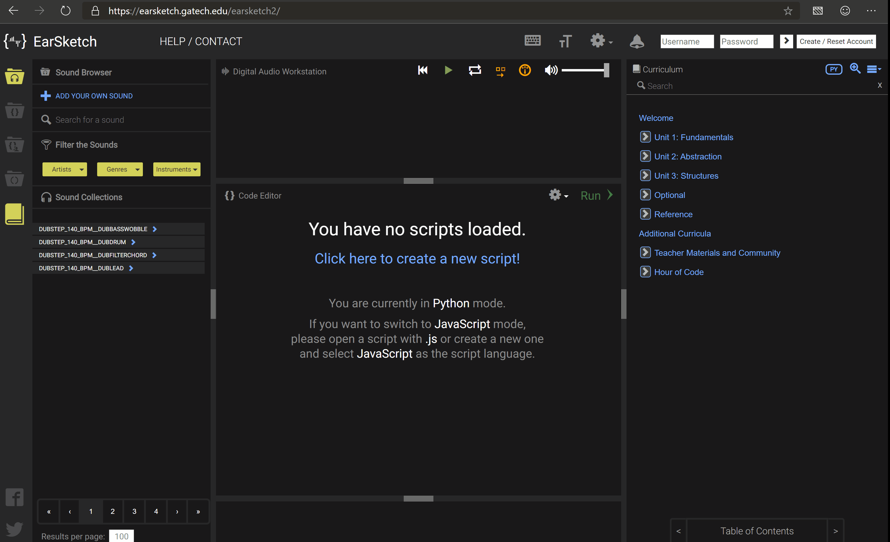
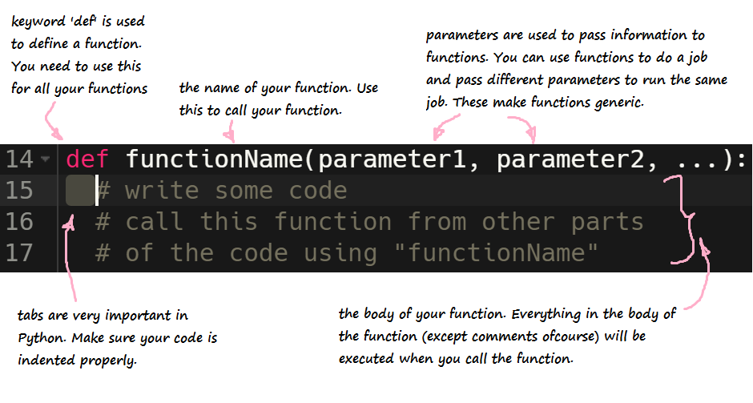
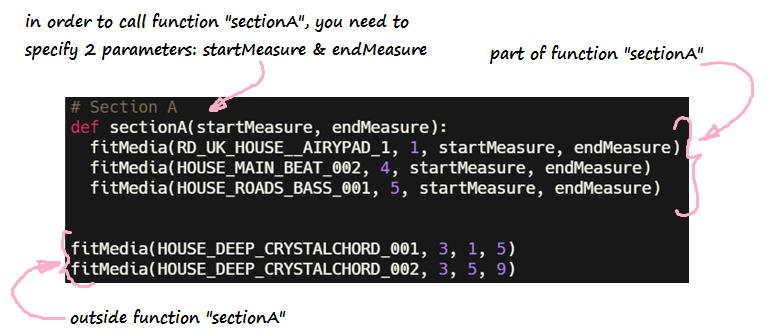

::: {.container-fluid}
::: {.container}
::: {.row}
::: {.col-sm-7}
Let\'s make some music {#lets-make-some-music .display-1 .mt-5}
======================

An introductory guide on how to make music using
[EarSketch](https://en.wikipedia.org/wiki/EarSketch) & Python.
:::

::: {.col-sm-5}
{.rounded
.mt-5 .d-block}
:::
:::
:::

------------------------------------------------------------------------

::: {.container-fluid}
::: {.row}
::: {.col-xs-6 .col-sm-4 .col-md-4 .col-lg-3}
::: {.list-group}
[**Introduction: Meet DJ Nuevo**](#intro){.list-group-item
.list-group-item-action} [**Music
basics**](#music-basics){.list-group-item .list-group-item-action}
[**Python basics**](#python-basics){.list-group-item
.list-group-item-action} [**Getting Started with
Earsketch**](#getting-started-earsketch){.list-group-item
.list-group-item-action} [**Activity 1** - Set tempo and Add
sounds](#activity-1){.list-group-item .list-group-item-action}
[**Activity 2** - Make a song](#activity-2){.list-group-item
.list-group-item-action} [**Functions**](#functions){.list-group-item
.list-group-item-action} [**Activity 3** - Organize your songs using
functions](#activity-3){.list-group-item .list-group-item-action}
[**Effects in Earsketch**](#effects){.list-group-item
.list-group-item-action} [**Activity 4** - Add effects to your
song](#activity-4){.list-group-item .list-group-item-action} [**Activity
5** - Fade in](#activity-5){.list-group-item .list-group-item-action}
[**Help, I am stuck!**](#help){.list-group-item .list-group-item-action}
:::
:::

::: {.col-xs-6 .col-sm-8 .col-md-8 .col-lg-9}
::: {#intro .container}
::: {.jumbotron}
{.rounded .mx-auto .d-block}

##### Nuevo has new headphones! Can you find yours? {#nuevo-has-new-headphones-can-you-find-yours .display-4 .text-center}

You got contacted to make Nuvi's next hit mixtape, but when you get to
the studio, Nuvi says their next project is going to be produced all in
code. This is something that hasn't been done before, are you up to the
challenge? Look around yourself to find your headphones and get ready to
join him!

Before we start, we should check if your headphones are working. Try
playing the following audio. What do you hear?

If you are reading this, it is because your browser does not support the
audio element.
:::

::: {#music-basics .my-4}
Basics first. A few things about music.
---------------------------------------

{.rounded .mx-auto .d-block width="900"
height="521"}

##### What is Music?

[Music](https://en.wikiversity.org/wiki/Introduction_to_music) is the
chronological organisation of sounds; that is, making certain sounds at
certain times, which make melodic, rhythmic and harmonic sense. The
first, most basic concept, is keeping the sounds \"in time\". This leads
us to some of the first few musical concepts: beat, rhythm, duration &
tempo.

-   **Beat** is the regular pulse which provides a \`timeline\` for the
    rhythm to anchor itself to.
-   **Rhythm** is essentially repeated patterns of long or short,
    stressed or unstressed sounds or silences which fit into the main
    beat.
-   **Duration** is the length of notes or sounds or silences which
    facilitate the rhythm.
-   **Tempo** is the speed at which a piece of music is played.
:::

::: {#python-basics .my-4}
Python basics
-------------

To code music, we need to learn a little Python. Don\'t worry, it won\'t
bite you 😊. We will learn Python concepts throughout the class, but
let\'s start with a simple print statement.

If you want to jump to a specific Python section, click on the topic
below:

-   [Print & Comments](#print-comments)
-   [Functions](#functions)

### Print & Comments

**Comments** are the parts of the code that do not get evaluated. In
Python, they are preceded by the \# symbol. Anything after the \# symbol
is part of the comment and is ignored by your comments. Comments are put
in the code to tell the readers what the code is doing. They can make
maintenace of code easy and can also help in finding bugs.

**Print** statements are used to print something on the console. Use
`print("Hello World")` to print \"Hello World\" in the output screen. We
will later learn that print is a function and we use it to perform a
print job. Whatever you pass to the `print` function is printed on the
screen.

Try it yourself! Write comment(s) below and add a print statement that
prints \"Hello World\"! Don\'t forget to surround Hello World with
quotation marks!

::: {datacamp-exercise="" lang="python"}
`                                     # This will get executed each time the exercise gets initialized                                 `{type="pre-exercise-code"}
`                                 `{type="sample-code"}
`                                     # This is a comment. Everything here will be ignored.                                     # Coders use this part to explain/maintain the code.                                     print("Hello World")                                 `{type="solution"}
`                                               test_function("print")                                 success_msg("Great work! Continue to the next section.")`{type="sct"}

::: {type="hint"}
Put the symbol (`#`) and write anything after it to create a comment.
Then use print function to print Hello World: Use
`print("Hello World")`.
:::
:::
:::
:::

::: {.container .mt-6}
::: {#getting-started-earsketch .my-4}
Getting started with EarSketch
------------------------------

1.  Open your favorite internet browser (Edge, Firefox, Google Chrome,
    Internet Explorer) and go to
    [EarSketch](https://earsketch.gatech.edu/earsketch2/).
2.  Click on {width="45" height="35"} icon on
    the left menu bar and select \"Create a new script\". When prompted
    to enter the script name, enter \"myjam\" and click on \"Create\"
    button. {.rounded .mx-auto .d-block
    width="956" height="524"}
3.  Do not delete any of the pre-existing code! We will insert our code
    in between them.

::: {#activity-1 .exercise-box}
Activity 1 - Set tempo & Add sounds
-----------------------------------

1.  Let\'s take a closer look at the pre-existing code and understand
    what it means. {.rounded
    .mx-auto .d-block width="800" height="324"}\
    We will be placing our new code between the `setTempo()` and
    `finish()` functions. The `setTempo()` function allows you to set
    the overall project tempo.\
    ::: {.alert .alert-info role="alert"}
    **Quick fact:** Tempo is the speed at which a piece of music is
    played. Changing a project\'s tempo allows for different styles of
    music to be created. Try changing the tempo of your `setTempo`
    function and see what happens! Please make sure it is a number
    between 45-220. {.rounded .mx-auto .d-block
    width="800" height="300"}
    :::

2.  Now that our tempo is set, it is time to add sounds. To do so, we
    must utilize the `fitMedia()` function.
3.  Make sure the cursor in your program is between `setTempo()` and
    `finish()` functions.\
    {.rounded .mx-auto .d-block
    width="325" height="150"}
4.  Navigate to {.img-icon} icon on the left
    side menu. Scroll through the list to the `fitMedia()` function.
5.  Click on {.img-icon} icon on the right corner
    of `fitMedia()` to insert the function between the \'setTempo\' and
    \'finish\' functions.
6.  You may notice that when you paste the function, the following text
    appears as placeholders for parameters.
    {.rounded .mx-auto
    .d-block width="756" height="324"}\
    You can specify your own values for the following:
    -   `fileName` - Navigate to the \'Sounds\' pane and find a sound
        you like.
    -   `trackNumber` - Select any positive integer as the track number.
    -   `startLocation/endLocation` - These parameters are quantified in
        measures. A measure is a segment of time which correlates to a
        specific number of beats.

    ::: {#color-card .card .w-75 .mx-auto .my-2}
    ::: {.card-body}
    ##### Cheat sheet: {#cheat-sheet .card-title}

    If you are not sure what values to choose, try this:
    `fitMedia(YG_TRAP_ELECTRIC_PIANO_FILTERED_1, 3, 1, 17)`\
    \
    Your code should now look something like this:
    `                                                 from earsketch import *                                                 init()                                                 setTempo(120)                                                                                                  fitMedia(YG_TRAP_ELECTRIC_PIANO_FILTERED_1, 3, 1, 17)                                                                                                  finish()`
    :::
    :::

    ::: {.alert .alert-info role="alert"}
    **Be careful:** Make sure the capitalization of the method call is
    correct. Most programming languages, Python included, are case
    sensitive. This means that adding capital letters can call a
    different function than expected. For example: `fitMedia()` is not
    the same as `FitMedia()`.
    :::

7.  Once you have input your own parameters, press run, then click on
    play to listen to your audio clip! **If you see any red text, you
    have encountered some errors! Please ask for help.** The
    `fitMedia()` function is the backbone to making music in Earsketch.
    We will be using this function a lot, so if you have any questions
    regarding its usage, please ask!
:::

::: {#activity-2 .exercise-box}
Activity 2 - Make a song
------------------------

Now that you have learned how to add sounds to Earsketch, let\'s try and
make a song! You should already have one audio clip in Earsketch, but
songs are made up of various instruments, so we need to add more audio
clips.

1.  Add another `fitMedia()` call.
2.  Find an audio clip you would like to add to your current song and
    input it under the \"fileName\" parameter.
3.  The \"trackNumber\" parameter should be a unique number. This will
    allow us to place our sounds on different tracks. Having different
    sounds on different tracks allows us to maintain organization of our
    sounds and play different sounds at the same time. Example: If the
    first `fitMedia()` call is on track 1, the second `fitMedia()` call
    should be on track 2.
4.  Complete the rest of the parameters.
5.  Repeat these steps until you have four different audio sounds in
    your song.

::: {#color-card .card .w-75 .mx-auto .my-2}
::: {.card-body}
##### Cheat sheet: {#cheat-sheet-1 .card-title}

Your code should now look something like this:
`                                             from earsketch import *                                             init()                                             setTempo(120)                                              fitMedia(RD_TRAP_BELLLEAD_1, 1, 5, 9)                                             fitMedia(YG_TRAP_STRINGS_2, 2, 1, 17)                                             fitMedia(YG_TRAP_ELECTRIC_PIANO_FILTERED_1, 3, 1, 17)                                             fitMedia(YG_TRAP_BASS_9, 4, 1, 9)                                                                                          finish()                                             `
:::
:::
:::

### Functions

**Functions** are a way to organize pieces of similar or repeating code.
Rather than having to constantly type out the same code, we can put the
desired code in a method and call it whenever we want to use it. To make
a function in python, we must use the `def` keyword. This keyword tells
the code editor where the function is defined. Here\'s what a function
looks like:

{.rounded .mx-auto .d-block
width="624" height="424"} In Python, tabs are what defines which code is
controlled by the function. For example, look at the following image:
{.rounded .mx-auto .d-block
width="756" height="324"} The code that is indented underneath the
`sectionA` function is the code that is executed each time the function
is called. The variables defined between the parentheses are known as
parameters. These parameters help generalize the functions so they can
be reused. If no parameters are needed, they can be ignored. To call a
function, input the name of the function and its parameters wherever you
want to execute the function. For example, in order to call function
`sectionA`, we would do something like this:
{.rounded .mx-auto .d-block
width="524" height="245"}

::: {.alert .alert-info role="alert"}
**Be careful:** When making a function in python, you must define the
function and its contents before it is called. Otherwise, you will
receive a NameError. See the following figure for an example:
{.rounded .mx-auto
.d-block width="524" height="345"}
:::

\

### Challenge - Create your own function!

::: {datacamp-exercise="" lang="python"}
`                                     # This will get executed each time the exercise gets initialized                                 `{type="pre-exercise-code"}
`                                     # Create a function called addNumbers                                      # that takes 2 parameters called number1 & number2                                     # and prints the sum on console.                                     # Call the function addNumbers with parameters 3 & 5.                                     # What is printed on the console?                                 `{type="sample-code"}
`                                     # Create a function called addNumbers                                      # that takes 2 parameters called number1 & number2                                     # and prints the sum on console.                                     # Call the function addNumbers with parameters 3 & 5.                                     # What is printed on the console?                                      def addNumbers(number1, number2):                                         print(number1+number2)                                      addNumbers(3,5)                                 `{type="solution"}
`                                     test_function("addNumbers")                                     success_msg("Great job!")                                 `{type="sct"}

::: {type="hint"}
Use (`def`) to create a function. Code inside function should be
\"TAB\"d. Call the function with parameters `3` & `5`.
:::
:::

\

::: {#activity-3 .exercise-box}
Activity 3 - Organize your songs using functions
------------------------------------------------

In Earsketch, functions are mostly used to organize different sections
of a song. The most common musical form is A-B-A where each section is
four measures in length, and the A sections sound different from the B
section.

Now that we learned how to use functions, let\'s try to use them to
organize our songs better.

1.  Define your function with a `startMeasure` parameter and
    `endMeasure` parameter.
2.  Place the sounds you would like to have the function represent
    underneath your function definition.
3.  Try to make multiple sections of a song (verse, chorus, intro, etc.)
    and define them with your functions. If you don\'t do this, and only
    use multiple `fitMedia` calls, you will notice that your program
    will become long and hard to understand. To help avoid having a
    large project file, use functions!
    ::: {.alert .alert-info role="alert"}
    **Note:** The purpose of a function is to help reduce redundant code
    throughout the program.
    :::

4.  The following is an example of how different sections of a song may
    look in the Digital Audio Workstation (DAW).
    ::: {.alert .alert-info role="alert"}
    **Quick Fact:** The Digital Audio Workstation is the area which the
    sounds appear in. It is at the center top of your EarSketch window.
    {.rounded .mx-auto .d-block width="800"
    height="300"}
    :::

::: {#color-card .card .w-75 .mx-auto .my-2}
::: {.card-body}
##### Cheat sheet: {#cheat-sheet-2 .card-title}

Your code should now look something like this:
`                                             from earsketch import *                                             init()                                             setTempo(120)                                                                                          fitMedia(HOUSE_DEEP_CRYSTALCHORD_001, 3, 1, 5)                                             fitMedia(HOUSE_DEEP_CRYSTALCHORD_002, 3, 5, 9)                                                                                          # Section A                                             def sectionA(startMeasure, endMeasure):                                                 fitMedia(RD_UK_HOUSE__AIRYPAD_1, 1, startMeasure, endMeasure)                                                 fitMedia(HOUSE_MAIN_BEAT_002, 4, startMeasure, endMeasure)                                                 fitMedia(HOUSE_ROADS_BASS_001, 5, startMeasure, endMeasure)                                                 # Section B                                             def sectionB(startMeasure, endMeasure, switchPart):                                                 tempMeasure = startMeasure + (endMeasure-startMeasure)/2                                                 if(not switchPart):                                                     fitMedia(Y37_ORGAN_1, 2, startMeasure, endMeasure)                                                     fitMedia(HOUSE_ROADS_BASS_001, 5, startMeasure, endMeasure)                                                     fitMedia(RD_UK_HOUSE__ARPLEAD_1, 6, startMeasure, tempMeasure)                                                 else:                                                     fitMedia(RD_UK_HOUSE__ARPLEAD_2, 6, tempMeasure, endMeasure)                                              sectionA(1, 9)                                             sectionB(9, 17, False)                                             sectionB(9, 17, True)                                              finish()                                             `
:::
:::
:::

### Effects in EarSketch {#effects}

**Effects** allows the producer to alter the sound of the audio clip
into its own unique sound. Similar to how we used `fitMedia()` to add
new audio clips, we must use the `setEffect()` function to define
specific effects for each audio clip. It is important to note that
multiple effects can be placed on the same track. This allows for the
producer to combine multiple effects together. Earsketch has many
effects built-in. To reference all the effects, visit this
[link](https://earsketch.gatech.edu/earsketch2/#?curriculum=5-1-0&language=python)

Before we start adding effects to our song, let\'s breakdown the pieces
of the two `setEffect` functions:
{.rounded .mx-auto .d-block
width="745" height="30"}

-   `track`: The track number to which the effect is applied to. Note:
    To apply an effect to the Master track, use 0 as the value for
    track. The master track is where all the audio is collectively
    played together. This is an easy way to apply an effect to all the
    sounds being processed.
-   `effectType`: The specific effect being used
-   `effectParameter`: The setting for the effect being used
-   `effectValue`: The value applied to the effectParameter

This `setEffect` function is used to apply an effect to a specific track
for the entire duration of the song, but what if you only want a
specific section of your song to have an effect? Use the `setEffect`
function with more parameters!
{.rounded .mx-auto .d-block
width="934" height="30"}

-   `effectStartValue`: The starting value applied to the parameter
-   `effectStartLocation`: The measure at which the starting value is
    set
-   `effectEndValue`: The ending value of the parameter
-   `effectEndLocation`: The measure at which the ending value is set

This version of the `setEffect` allows for us to perform \"automation\"
on a specific piece of our song. Automation is a way to change the value
of an effect over time. One use of automation is to make a song fade in
or fade out. To do so, we must adjust the **GAIN** `effectParameter`
volume in the **VOLUME** `effectType` over time. For example, if we
define our `effectStartValue` at -60 db and our `effectEndValue` at 0
db, it will sound like our song is fading in over time. To adjust the
starting point and length of the effect, specify the
`effectStartLocation` and `effectEndLocation`.

::: {#activity-4 .exercise-box}
Activity 4 - Add effects to your song
-------------------------------------

Since we are more familiar with using effects, let\'s add an effect to
our song.

1.  Insert a `setEffect` function call into your code.
2.  Navigate to Curriculum {.img-icon} \>
    Reference \> \"Every Effect Explained in Detail\".
3.  You may notice that Earsketch has many different variations of
    effects. For now, we will use the DELAY `effectType` in our song.
4.  Now, pick an `effectParameter` associated with DELAY. Here is an
    example of the `effectParameters` DELAY has to offer:
    
5.  We recommend using the DELAY\_FEEDBACK `effectParameter`. View the
    details for the `effectParameters` in the image above.
6.  For the final parameter, input a valid value. Example: Use -6.0 as
    your effect value for DELAY\_FEEDBACK.

::: {#color-card .card .w-75 .mx-auto .my-2}
::: {.card-body}
##### Cheat sheet: {#cheat-sheet-3 .card-title}

Your code should now look something like this:
`                                             from earsketch import *                                             init()                                             setTempo(120)                                                                                          fitMedia(HOUSE_DEEP_CRYSTALCHORD_001, 3, 1, 5)                                             fitMedia(HOUSE_DEEP_CRYSTALCHORD_002, 3, 5, 9)                                                                                          # Section A                                             def sectionA(startMeasure, endMeasure):                                                 fitMedia(RD_UK_HOUSE__AIRYPAD_1, 1, startMeasure, endMeasure)                                                 fitMedia(HOUSE_MAIN_BEAT_002, 4, startMeasure, endMeasure)                                                 fitMedia(HOUSE_ROADS_BASS_001, 5, startMeasure, endMeasure)                                                 # Section B                                             def sectionB(startMeasure, endMeasure, switchPart):                                                 tempMeasure = startMeasure + (endMeasure-startMeasure)/2                                                 if(not switchPart):                                                     fitMedia(Y37_ORGAN_1, 2, startMeasure, endMeasure)                                                     fitMedia(HOUSE_ROADS_BASS_001, 5, startMeasure, endMeasure)                                                     fitMedia(RD_UK_HOUSE__ARPLEAD_1, 6, startMeasure, tempMeasure)                                                 else:                                                     fitMedia(RD_UK_HOUSE__ARPLEAD_2, 6, tempMeasure, endMeasure)                                              sectionA(1, 9)                                             sectionB(9, 17, False)                                             sectionB(9, 17, True)                                                                                          setEffect(2, DELAY, DELAY_FEEDBACK, -6.0)                                             setEffect(2, DELAY, DELAY_TIME, 1200.0)                                             setEffect(0, VOLUME, GAIN, -60, 1, 0, 3)                                             finish()                                             `
:::
:::
:::

::: {#activity-5 .exercise-box}
Activity 5 - Fade in
--------------------

Now that you have one effect in your song, let\'s try to fade in the
introduction of our song.

1.  Add another `setEffect` function call into your code, but ensure the
    following parameters are present:
    {.rounded .mx-auto .d-block
    width="934" height="30"}
2.  Use the \"Every Effect Explained in Detail\" reference guide to see
    which parameters VOLUME has.
3.  To adjust the loudness of an audio clip, use the GAIN
    `effectParameter`.
4.  If we want to make something sound like it is fading in, we must
    have the sound\'s volume start at nothing and increase it until
    around 0 decibels.
    ::: {.alert .alert-info role="alert"}
    **Hint:** Volume is measured in decibels. In decibels, the more
    positive a number is, the louder it gets. Also, try not to exceed 0
    decibels.
    :::

5.  To do so, we must start the effectParameter at a very low value.
:::
:::

------------------------------------------------------------------------

Help, I am stuck! {#help .help}
-----------------

#### No worries! See if any of the following helps you, if not, feel free to call one of us, and we will help you.

1.  
    Identation is very important when you are working in Python. Be
    careful of spaces & tabs in your code, because \"Indentation\"
    errors can sometimes be pretty difficult to spot. However on the
    positive side, strict formatting makes Python code very clean and
    organized. Are all your variables, functions indented properly as
    intructed?
2.  SyntaxError: invalid syntax
3.  IndentationError: expected an indented block
4.  IndentationError: unexpected indent
5.  NameError: global name \'\-\--\' is not defined
6.  Cannot recognize error: spelling mistake?
7.  TypeError: Can\'t convert \'int\' object to str implicitly
:::
:::
:::

::: {.container-fluid}

------------------------------------------------------------------------

::: {.row .justify-content-md-center}
::: {.col .my-auto}
{#footer-img .float-right}
:::

::: {.col .my-auto}
Nuevo Foundation
:::
:::
:::
:::
:::
